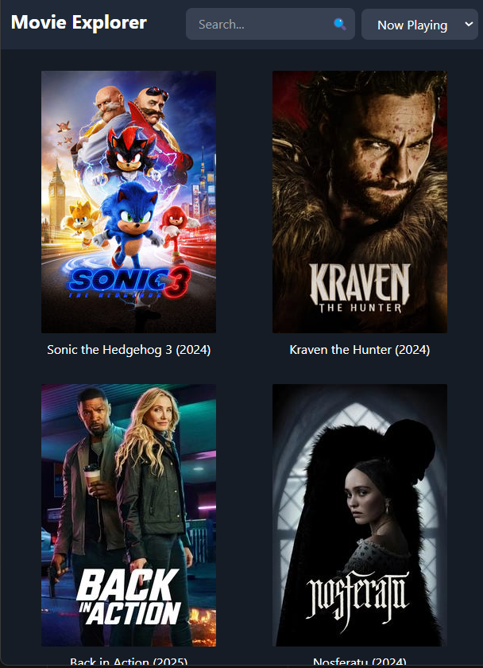
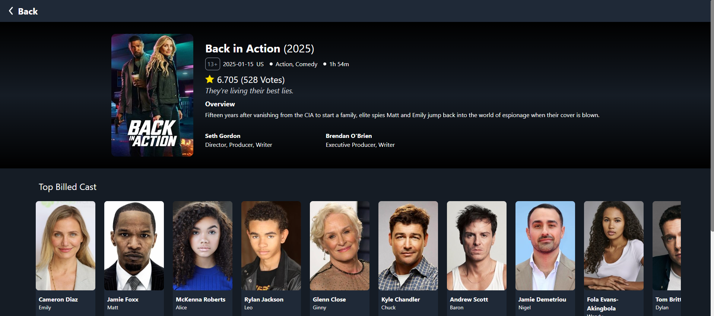
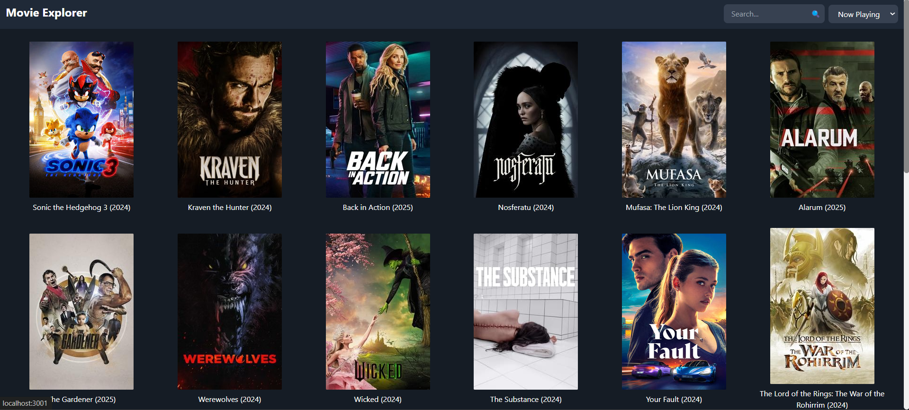

# Web Application Technical Test - Movie Explorer

This web application, **Movie Explorer**, allows users to explore movies fetched from the TMDB (The Movie Database) API. The app includes features like searching for movies, viewing detailed information about each movie, and infinite scrolling to load more movie data.

## Table of Contents

1. [Overview](#overview)
2. [Features](#features)
3. [Tech Stack](#tech-stack)
4. [Performance Approaches](#performance-approaches)
5. [Installation](#installation)
6. [Folder Structure](#folder-structure)

   
## Overview

### Demo
You can easily access the web application [movie-explorer-zeta.vercel.](https://movie-explorer-zeta.vercel.app/) or run it manually by cloning this repository.

### Screenshots
#### Mobile
<div style="justify-content: space-around; display:flex; gap: 10px; width:500px">
  
  
  
</div>

#### Dekstop
<div style="justify-content: space-around; gap: 10px; width:500px">
  
  
</div>

## Features

### 1. **Display Movie List**
- Fetches movie data from the TMDB API.
- Displays movies in card format with key information:
  - Title
  - Release year
  - Poster
- Each movie card includes a link to view detailed information.

### 2. **Movie Search**
- Allows users to search for movies by title.
- Dynamically displays results based on the search query.

### 3. **Category Filtering**
- Movies can be filtered by categories:
  - Now Playing
  - Popular
  - Top Rated
  - Upcoming

### 4. **Movie Detail Page**
- Displays detailed information about a selected movie, including:
  - Synopsis
  - Main cast
  - Director
  - Poster
- Includes a "Back" button for seamless navigation to the movie list.

### 5. **Pagination**
- Infinite scrolling implemented to load additional movies as the user scrolls down.

### 6. **Responsive Design**
- Fully responsive UI using **Tailwind CSS** for a modern, mobile-friendly design.

### 7. **Testing**
- Unit tests written with **Jest** and **React Testing Library** to ensure code quality and stability.


## Tech Stack

This project uses the **KISS (Keep It Simple and Straightforward)** principle to ensure simplicity, maintainability, and performance. The stack is minimal yet scalable, supporting future enhancements with ease.

### Core Technologies
- **React.js**: For building dynamic and efficient user interfaces.
- **TypeScript**: Ensures robust type safety and reduces runtime errors.
- **React Query**: Simplifies data fetching, caching, and synchronization.
- **Tailwind CSS**: Utility-first CSS framework for a sleek and responsive UI.
- **Jest**: For writing unit tests and ensuring reliability.

## Performance Approaches

### Minimized Render Times

- **Memoization**: Used `React.memo` for components and `useMemo`/`useCallback` hooks to prevent unnecessary re-renders.
- **Debounced Search**: Implemented debounce logic for search input to reduce the frequency of re-renders.

### API Optimization

- Implemented caching for API responses using react-query for better experience.

### Component Modularization

- Split components into smaller, reusable units to enhance maintainability and reusability.

## Installation

1. Clone the repository:
   ```bash
   git clone https://github.com/rezarffahlevi/movie-explorer.git
   ```
2. Install dependencies:
   ```bash
   cd movie-explorer
   npm install
   ```
3. Run the application:
   ```bash
   npm run dev
   ```

## Folder Structure

```plaintext
src/
├── components/         # Reusable UI components, including shimmer and card elements
├── hooks/              # Custom hooks for encapsulating reusable logic
├── routes/             # Route definitions for each page
├── utils/              # Utility functions and helpers (e.g., data formatting)
├── services/           # Services for API calls and data fetching logic
```
